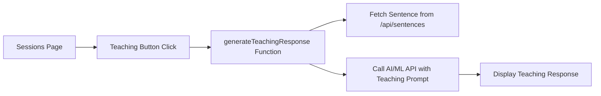

# LLM Teaching Mode Design Document

## Overview

The LLM Teaching Mode feature provides simple AI-powered language instruction using AI/ML API's GPT-4o model. The system fetches a sentence from the existing sentence bank, sends it to GPT-4o with a teaching prompt, and displays the AI's teaching response on the sessions page. This is a straightforward integration focused on demonstrating the core teaching functionality for the hackathon MVP.

## Architecture

### Simple Architecture Flow



### System Flow

1. **User Action**: User clicks "Get Teaching" button on sessions page
2. **Sentence Fetch**: Function calls existing `/api/sentences` endpoint to get a random sentence
3. **AI Call**: Send sentence + teaching prompt to AI/ML API GPT-4o model
4. **Response Display**: Show AI's teaching response with sentence, pronunciation, meaning, and encouragement

## Components and Interfaces

### Core Teaching Mode Function

**Location**: `src/lib/teachingMode.ts`

```typescript
interface TeachingRequest {
  language: string;
  difficulty: string;
  authToken: string;
}

interface TeachingResponse {
  success: boolean;
  data?: {
    sentence: string;
    pronunciation: string;
    meaning: string;
    teaching_explanation: string;
    encouragement: string;
  };
  error?: string;
}

async function generateTeachingResponse(request: TeachingRequest): Promise<TeachingResponse>
```

### AI/ML API Integration

Simple fetch call to AI/ML API:

```typescript
const response = await fetch('https://api.aimlapi.com/v1/chat/completions', {
  method: 'POST',
  headers: {
    'Authorization': `Bearer ${process.env.AIML_API_KEY}`,
    'Content-Type': 'application/json',
  },
  body: JSON.stringify({
    model: 'gpt-4o',
    messages: [
      {
        role: 'system',
        content: 'You are a language tutor. Teach the given sentence...'
      },
      {
        role: 'user',
        content: `Teach this sentence: ${sentence}`
      }
    ],
    max_tokens: 500,
    temperature: 0.7
  })
});
```

### Frontend Integration

Add to existing sessions page:

```typescript
// Add to sessions page state
const [teachingResponse, setTeachingResponse] = useState<TeachingResponse | null>(null);
const [teachingLoading, setTeachingLoading] = useState(false);

// Add button and display logic
<Button onClick={handleGetTeaching} disabled={teachingLoading}>
  {teachingLoading ? 'Getting Teaching...' : 'Get Teaching'}
</Button>

{teachingResponse && (
  <Card>
    <CardContent>
      <h3>{teachingResponse.data.sentence}</h3>
      <p><strong>Pronunciation:</strong> {teachingResponse.data.pronunciation}</p>
      <p><strong>Meaning:</strong> {teachingResponse.data.meaning}</p>
      <p>{teachingResponse.data.teaching_explanation}</p>
      <p><em>{teachingResponse.data.encouragement}</em></p>
    </CardContent>
  </Card>
)}
```

## Data Models

### Simple Teaching Prompt Template

```typescript
const TEACHING_PROMPT = `You are a friendly language tutor. I will give you a sentence in a target language, and you should teach it to a student.

Please respond with a JSON object containing:
- sentence: the original sentence
- pronunciation: phonetic guide for pronunciation
- meaning: English translation/meaning
- teaching_explanation: brief explanation of grammar or usage (2-3 sentences)
- encouragement: motivational message for the student

Keep explanations simple and encouraging. Focus on practical usage.

Target Language: {language}
Difficulty Level: {difficulty}
Sentence to teach: {sentence}`;
```

### Sentence Bank API Call

```typescript
// Simple API call to existing endpoint
const sentenceResponse = await fetch(`/api/sentences?language=${language}&difficulty=${difficulty}&limit=1`, {
  headers: {
    'Authorization': `Bearer ${authToken}`,
    'Content-Type': 'application/json'
  }
});

const sentences = await sentenceResponse.json();
const selectedSentence = sentences[0]; // Use first sentence returned
```

## Error Handling

### Simple Error Handling

```typescript
try {
  // Fetch sentence
  const sentenceResponse = await fetch(`/api/sentences?language=${language}&difficulty=${difficulty}&limit=1`);
  if (!sentenceResponse.ok) {
    throw new Error('Failed to fetch sentence');
  }
  
  // Call AI/ML API
  const aiResponse = await fetch('https://api.aimlapi.com/v1/chat/completions', { /* ... */ });
  if (!aiResponse.ok) {
    throw new Error('AI/ML API call failed');
  }
  
  return { success: true, data: parsedResponse };
} catch (error) {
  console.error('Teaching mode error:', error);
  return { 
    success: false, 
    error: 'Failed to generate teaching response. Please try again.' 
  };
}
```

### Fallback Content

If APIs fail, show simple fallback:

```typescript
const FALLBACK_RESPONSE = {
  sentence: "Hola, ¿cómo estás?",
  pronunciation: "OH-lah, KOH-moh ehs-TAHS",
  meaning: "Hello, how are you?",
  teaching_explanation: "This is a common greeting in Spanish. Use it to ask someone how they are doing.",
  encouragement: "Great choice! This is one of the most useful phrases to learn first."
};
```

## Testing Strategy

### Manual Testing

1. Test with different languages (es, fr, de, it, pt)
2. Test with different difficulty levels (beginner, intermediate, advanced)
3. Verify AI responses are properly formatted JSON
4. Test error handling when APIs are unavailable
5. Check that teaching responses are educational and encouraging

### Environment Setup

1. Add `AIML_API_KEY` to `.env.local`
2. Ensure sentence bank has content for testing languages
3. Test authentication with existing session management